# System Architecture Diagrams

## High-Level System Overview

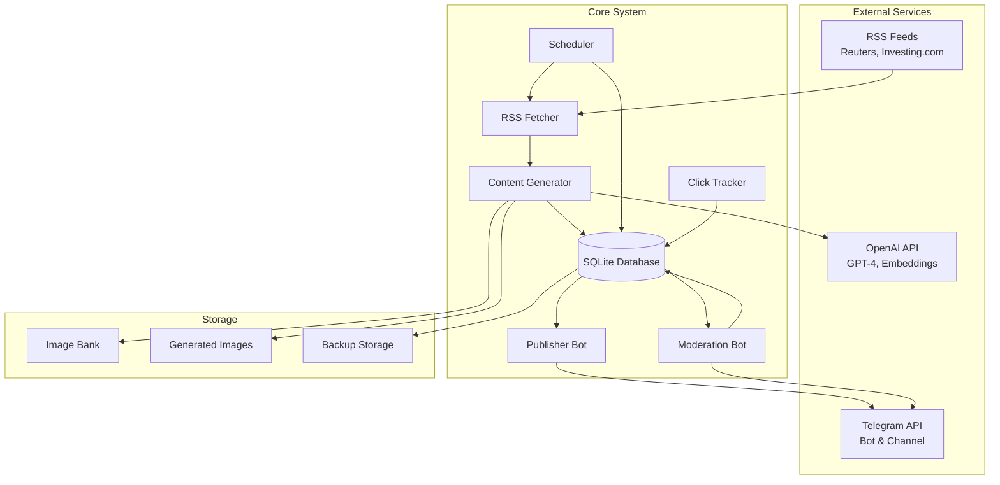

## Data Flow Architecture

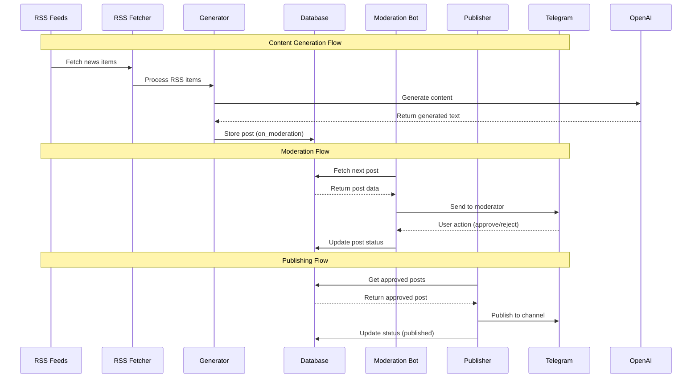

## Database Schema

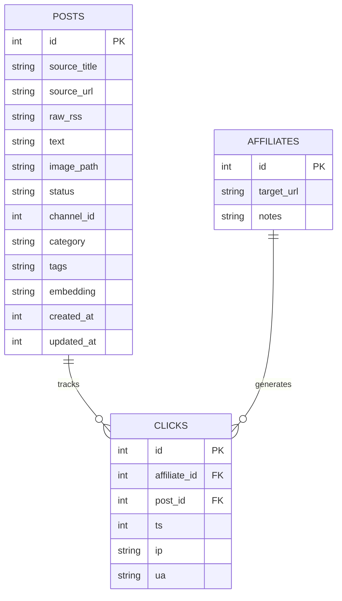

## Component Interaction Diagram

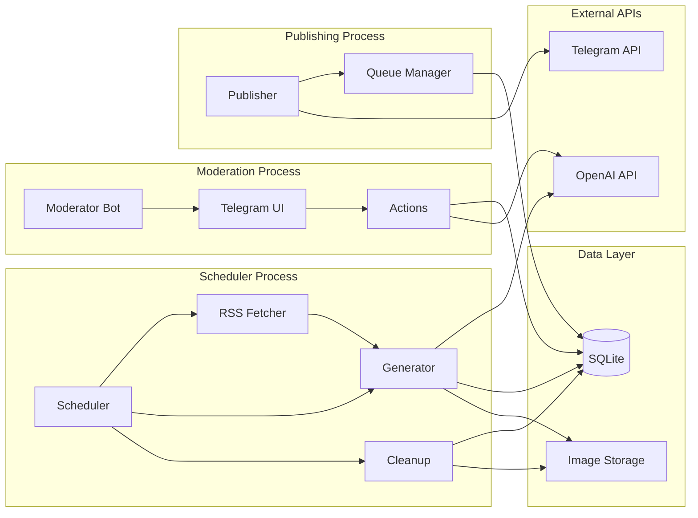

## Service Architecture

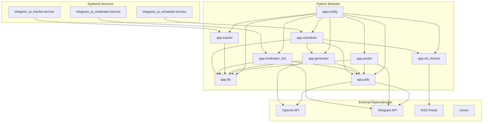

## State Machine - Post Lifecycle

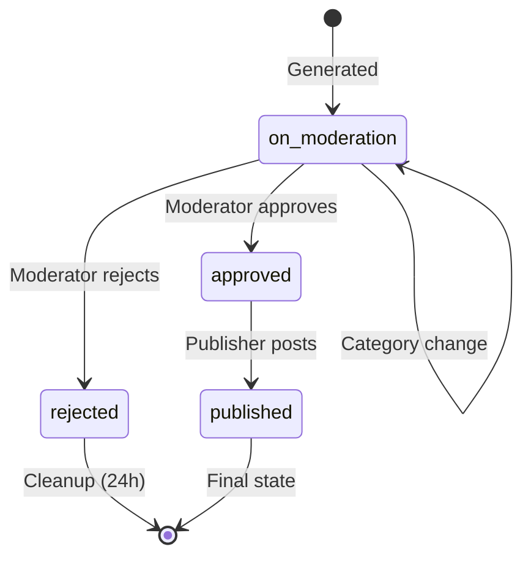

## Error Handling Flow

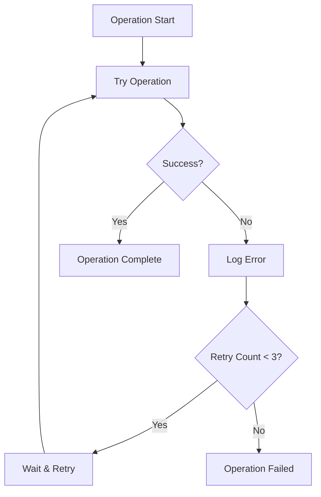

## Security Architecture

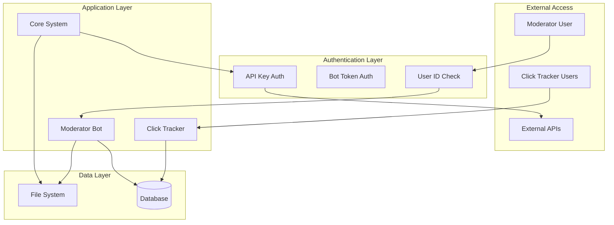

## Monitoring and Logging

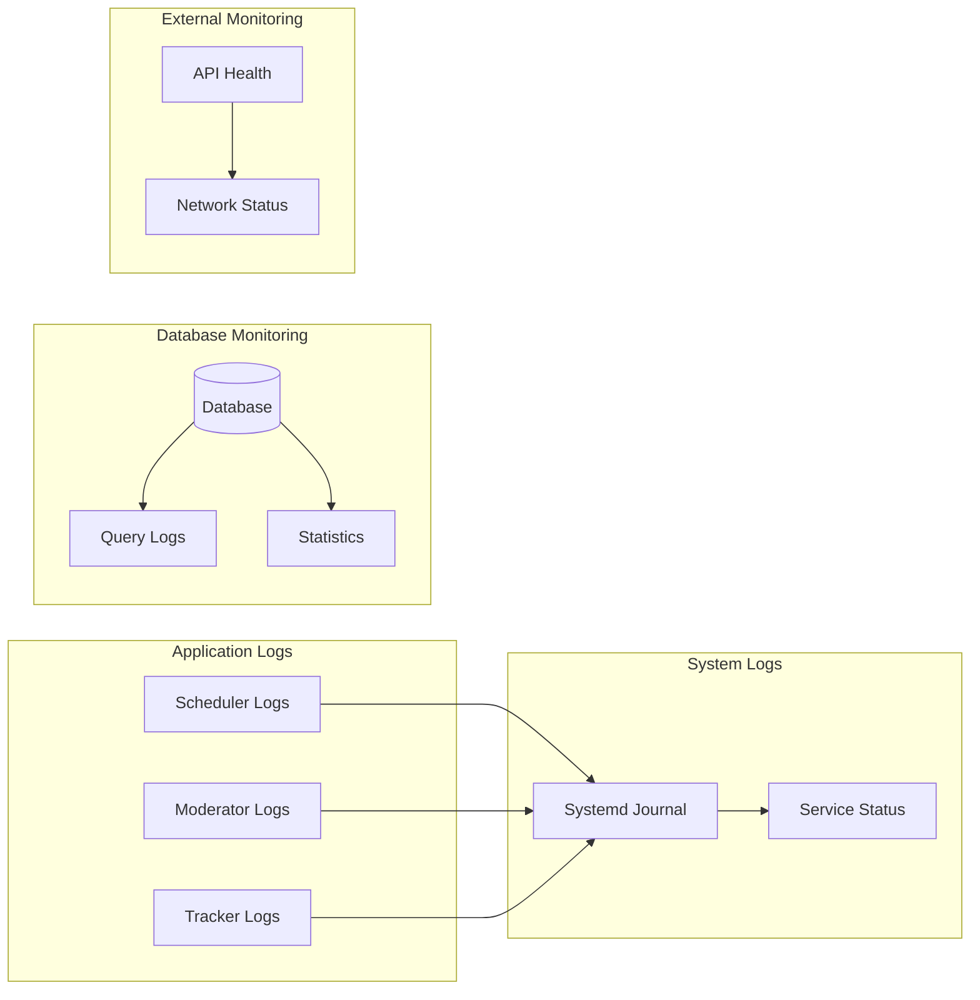

## Backup and Recovery

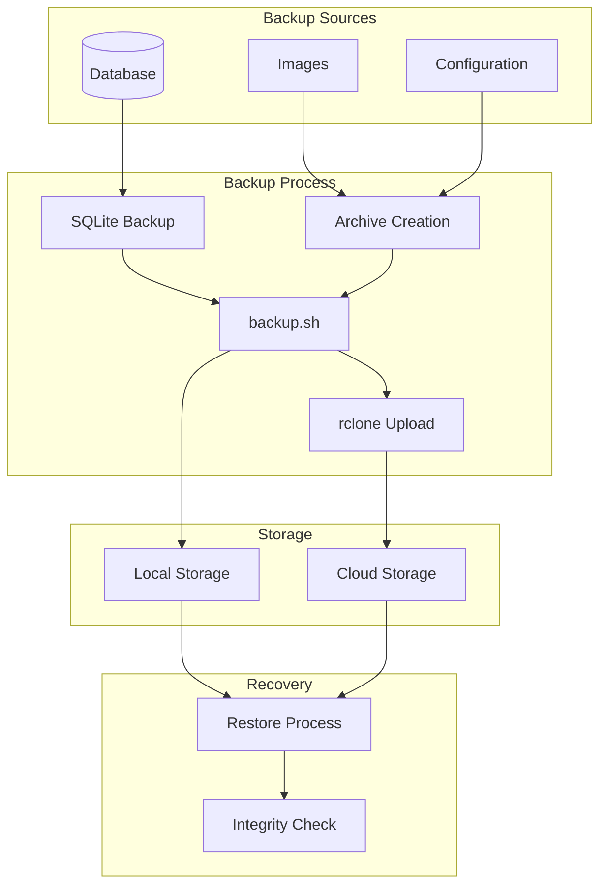

## Performance Characteristics

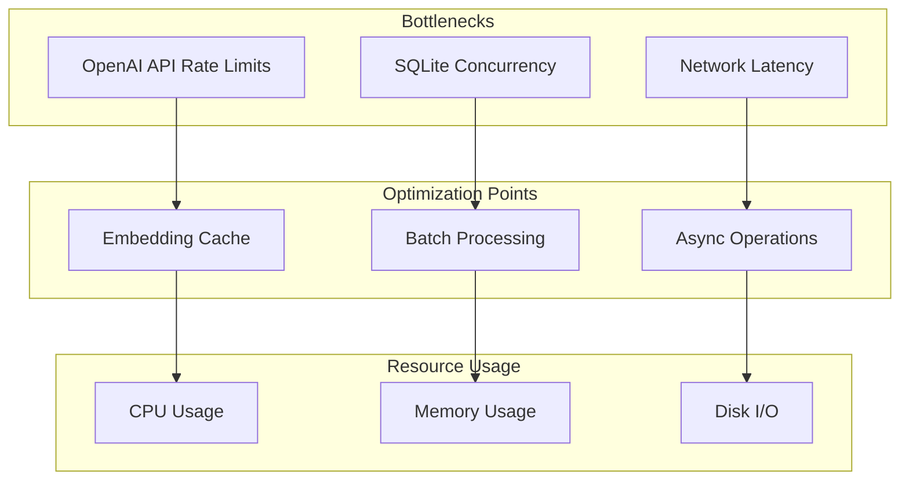

This architecture documentation provides visual representations of the system's structure, data flow, and operational characteristics, making it easier to understand the system's design and identify areas for improvement.